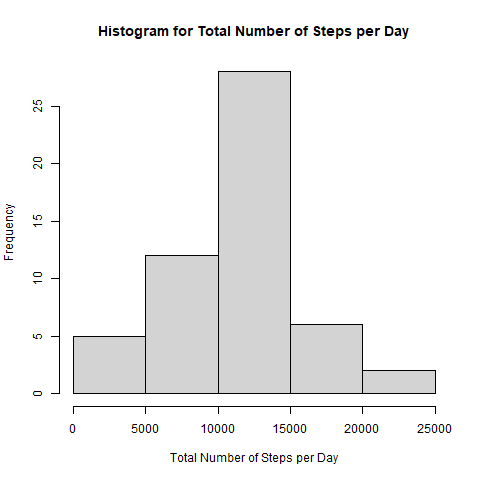
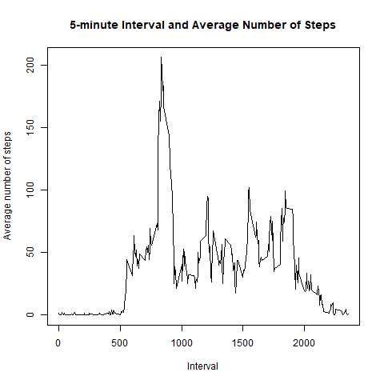
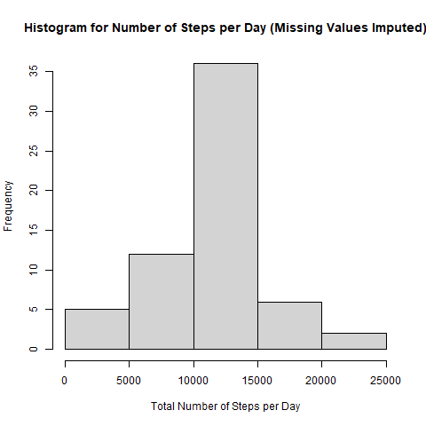
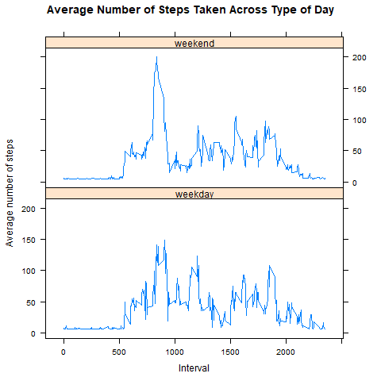

#Course Project 1 for Reproducible Research
## Peer Assignment 1
### Part 1- 1. Loading the data 
```{r, echo=TRUE}
knitr::opts_chunk$set(warning=FALSE)
#Setting up the folder, downloading data and unzipping the file 
#Setting the path to the directory storing the data 
setwd("E:/Coursera/Reproducible Research/Week 2 Peer Review")
#Downloading the file
if(!file.exists("./data")){dir.create("./data")
        fileURL <- "https://d396qusza40orc.cloudfront.net/repdata%2Fdata%2Factivity.zip"
        download.file(fileURL,destfile="./data/Dataset.zip")
        #(II) Unzip the downloaded file
        unzip(zipfile="./data/Dataset.zip",exdir="./data")}
if (!exists("activity")) {
        activity <- read.csv("./data/activity.csv") 
}
```


### Part 1- 2. Transforming the date into a suitable format
```{r, echo=TRUE}

activity$date <- as.POSIXct(activity$date, "%Y-%m-%d", tz=Sys.timezone(location = TRUE))

```
### Part 2- 1. Calculate the total number of steps taken per day
```{r , echo=TRUE}
stepsperday <- aggregate(steps~date, activity, FUN=sum, na.rm=TRUE)
head(stepsperday)
```
### Part 2- 2. Make a histogram for the total number of steps taken per day
```{r , echo=TRUE, out.width='80%'}
png(file="plot1.png", width=480, height=480)
hist(stepsperday$steps, xlab="Total Number of Steps per Day", main="Histogram for Total Number of Steps per Day")

dev.off()
```

### Part 2- 3. Calculate the mean and median of the total number of steps taken per day
```{r , echo=TRUE}
options(digits = 2)
options(scipen = 999)
meansteps <- mean(stepsperday$steps, na.rm=TRUE)
mediansteps <- median(stepsperday$steps, na.rm=TRUE)
```

### Answer: The mean steps per day is `r meansteps` and the median steps per day is `r mediansteps`.

### Part 3-1. Make a time series plot (type="l") of the 5 minute interval and the average number of steps taken across all days
```{r , echo=TRUE, out.width = '80%'}
stepsperinterval <- aggregate(steps ~ interval, activity, FUN=mean)
png(file="plot2.png", width=480, height=480)
p2 <- plot(stepsperinterval$interval, stepsperinterval$steps, data=activity, type="l", ylab="Average number of steps", xlab="Interval", main="5-minute Interval and Average Number of Steps")

dev.off()

```

### Part 3-2. Which 5-minute interval, on average across all the days in the dataset, contains the maximum number of steps?
```{r, echo=TRUE}
maximumsteps <- stepsperinterval[which.max(stepsperinterval$steps),]$interval
```
### Answer: The maximum number of steps belongs to interval `r maximumsteps`

### Part 4-1. Calculate and report the total number of missing values in the dataset
```{r , echo=TRUE}
colSums(is.na(activity))
```
### Part 4-2 and 4-3. Devise a strategy for filling in all of the missing values in the dataset. Also create a new data set with missing values filled.
```{r, echo=TRUE}
activity_imputed <- activity 
activity_imputed$steps[is.na(activity_imputed$steps)] <- mean(activity_imputed$steps, na.rm=TRUE)
colSums(is.na(activity_imputed))
```
### Part 4-4. Make a histogram of the total number of steps taken each day and Calculate and report the mean and median total number of steps taken per day.
```{r, echo=TRUE, out.width='80%'}
stepsperday_imputed <- aggregate(steps ~ date, activity_imputed, FUN= sum)
png(file="plot3.png", width=480, height=480)
hist(stepsperday_imputed$steps, xlab="Total Number of Steps per Day", main="Histogram for Number of Steps per Day (Missing Values Imputed)")
meansteps_imputed <- mean(stepsperday_imputed$steps)
mediansteps_imputed <- median(stepsperday_imputed$steps)

dev.off()
```
### Answer: The mean steps per day is `r meansteps_imputed` and the median steps per day is `r mediansteps_imputed` after imputing missing values. The mean is the same as mean values are used to impute missing values but median converges to the mean when missing values are imputed.This is as expected.

### Part 5-1. Create a new factor variable in the dataset with two levels - "weekday" and "weekend" indicating whether a given date is a weekday or weekend day.
```{r, echo=TRUE}
activity_imputed_day<- transform(activity_imputed, date=as.Date(date, format="%Y-%m-%d"))
activity_imputed_day$typeofday <-  as.factor(ifelse(weekdays(activity_imputed_day$date) %in% c("Saturday", "Sunday"), "weekend", "weekday"))
table(activity_imputed_day$typeofday)
```
### Part 5-2. Make a panel plot containing a time series plot of the 5-minute interval (x-axis) and the average number of steps taken, averaged across all weekday days or weekend days (y-axis). 
```{r, echo=TRUE}
stepsperdaybytype <- aggregate(steps ~ interval + typeofday, FUN=mean, activity_imputed_day)
```

```{r, echo=TRUE, out.width='80%'}
png(file="plot4.png", width=480, height=480)
library(lattice)

xyplot(stepsperdaybytype$steps ~ interval | typeofday, activity_imputed_day, type="l", layout = c(1, 2), xlab="Interval",  ylab="Average number of steps", main ="Average Number of Steps Taken Across Type of Day" )

dev.off()
```
